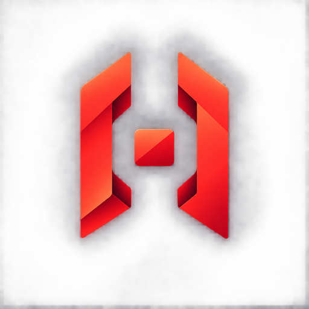
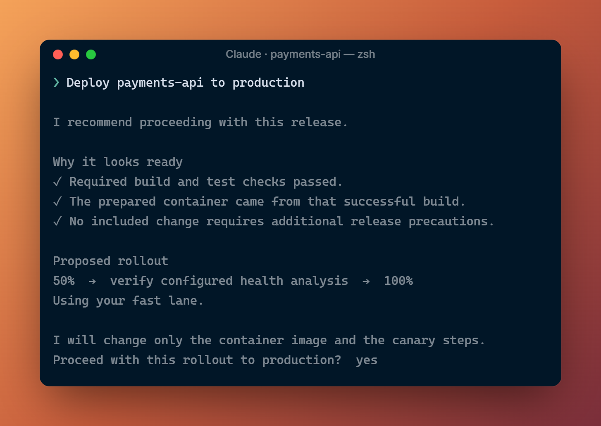

<p align="center">
  
</p>

<h1 align="center">SafeLane</h1>

<p align="center"><strong>Autonomous progressive delivery for coding agents.</strong></p>

<p align="center">Approve once. SafeLane checks the exact release and coordinates your existing Argo Rollout to completion or a safe stop.</p>

<p align="center">
  <a href="https://github.com/AndrewMaged814/safelane/actions/workflows/ci.yml"></a>
  <a href="https://andrewmaged814.github.io/safelane/"></a>
  <a href="LICENSE"></a>
</p>

SafeLane gives coding agents a controlled release path. It checks the candidate, CI result, OCI image, running version, complete change, target, and health analysis.

It then recommends **proceed** or **wait**. After one exact approval, SafeLane changes the image and canary steps. Argo controls health, abort, and rollback.

<p align="center">
  
</p>

## Why SafeLane

- **Exact release.** Source, CI, OCI artifact, and running baseline agree.
- **Clear recommendation.** See the hazards, health checks, and rollout steps.
- **One approval.** Approval applies to one candidate, target, and patch.
- **Complete outcome.** SafeLane follows Argo and stores release proof.

## Use SafeLane

From an application repository, ask Claude or Codex:

```text
Register this application in production.
Deploy payments-api to production.
```

SafeLane works with an existing Argo canary Rollout. It does not provision a cluster or create health checks.

## Install

macOS and Linux:

```bash
curl -fsSL https://raw.githubusercontent.com/AndrewMaged814/SafeLane/main/docs/install.sh | sh
```

Windows PowerShell:

```powershell
irm https://raw.githubusercontent.com/AndrewMaged814/SafeLane/main/docs/install.ps1 | iex
```

## Release boundary

SafeLane can change only:

```text
/spec/template/spec/containers/<selected-index>/image
/spec/strategy/canary/steps
```

Read the [Quick Start](https://andrewmaged814.github.io/safelane/start-here/quick-start/), [compatibility requirements](https://andrewmaged814.github.io/safelane/reference/compatibility/), or [roadmap](https://andrewmaged814.github.io/safelane/roadmap/).

SafeLane began as a DevOpsDays Cairo 2026 hackathon project.

## License

[MIT](LICENSE)
