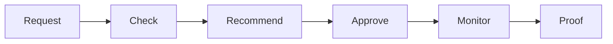

## 1. Check

SafeLane identifies the candidate source revision, OCI image, running version, CI result, target, and health analysis.

## 2. Freeze

SafeLane creates an immutable Release Delta. It contains all changes from the running version to the candidate.

## 3. Recommend

The agent recommends **proceed** or **wait**. A proceed result includes one configured release lane.

## 4. Approve

You approve the exact candidate, target, lane, and patch. SafeLane checks them again before mutation.

## 5. Monitor

SafeLane changes the image and canary steps. It follows Argo through each health gate.

## 6. Prove

SafeLane records the evidence, patch, events, and outcome.

Next: [Assessment](./assessment/) and [history and proof](./record-and-proof/).
